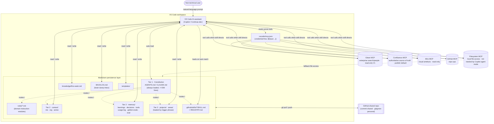

# Personal OS — Architecture

> Status: Draft v1.1 · OQs resolved · Owner: Head of Product Operations · Last revised: 2026-06-21
> Scope: VS Code–native, AI-augmented Personal OS for product operations. Zero custom code, zero infrastructure, plain-markdown persistence, any-VS-Code-AI compatible, GitHub-backed for team sharing.

This document is the architectural source of truth for the Personal OS. It records the consequential decisions, the runtime model, the components, the data model, the integration contracts, a vertical-slice build plan, the non-functional thresholds, and a register of the now-resolved technical decisions. As of v1.1 all ten open technical questions have been resolved; their answers are recorded in §8 and propagated throughout this document.

The system is unusual: there is no compiled artefact and no running process we control. The "system" is a structured set of markdown files in a Git repository, interpreted at runtime by whatever VS Code AI assistant the user has installed. Every architectural lever is therefore either (a) a file's existence and location, (b) the natural-language instructions inside a file, or (c) the boundary between what is committed vs. gitignored. The architecture is the file layout and the instruction contracts between files — nothing more, and nothing less.

---

## 1. Architecture Decisions

The eight most consequential decisions. Each lists the decision, why it was chosen, what was rejected, and what it commits us to.

### AD-1 — File-based markdown is the only persistence layer

**Decision.** All durable state lives in plain `.md` files in the workspace. No database, no vector store, no SQLite, no background service. The AI reads and writes these files directly through the filesystem.

**Rationale.** This is the only persistence model that satisfies all four hard constraints at once — zero custom code, zero infrastructure cost, non-technical maintainability, and portability across every VS Code AI assistant. Files are diffable, git-versionable, and human-readable, which makes the "non-technical user can maintain their own context" goal (G2) achievable without tooling.

**Rejected alternatives.** *In-context-only* (volatile; loses all memory between sessions; V0 exploration only). *External vector DB / SQLite* (better semantic recall at scale but requires custom code and maintenance, violating G5; the research report scopes this only as a future option above ~500 files).

**Consequences.** Retrieval is lexical and AI-mediated, not semantic-indexed — the AI must be *told where to look* via routing instructions rather than relying on embeddings. Memory files must be actively pruned (AD-6) because there is no query engine to manage growth. Scale ceiling is a real risk to monitor (see NFR Performance and §8).

### AD-2 — Three-tier context hierarchy with a strict Tier-1 size budget

**Decision.** Context is partitioned into three tiers: **Tier 1 — Constitution** (`AGENTS.md`/`CLAUDE.md`, always loaded, hard ceiling 200 lines), **Tier 2 — Living Memory** (`context/` + `memory/`, loaded on demand or appended each session), **Tier 3 — Project Brains** (`projects/` + `areas/`, loaded only by explicit trigger phrase).

**Rationale.** Always-loading everything causes context-window bloat and quality drift (the most-cited Approach-A failure mode in the research). Tiering keeps the always-on payload small while making deep context available on request. The 200-line ceiling is the single enforceable discipline that prevents Tier 1 from silently becoming a dump.

**Rejected alternatives.** *Single flat instruction file* (Approach A — zero learning curve but bloats and drifts; demoted to V0). *Foam graph-traversal MCP* (Approach D — promising token savings but adds an extension dependency and immature tooling; kept optional, see §8).

**Consequences.** The constitution is a *router*, not a knowledge store — it must point to lower tiers rather than contain them. Tier-3 loading depends on the user (or a skill) issuing a trigger phrase; if they don't, the AI works without project depth. Tier discipline must be audited (the OS-Helper "audit" mode and weekly staleness ritual exist for this).

### AD-3 — `AGENTS.md` is canonical and primary; `CLAUDE.md` is a thin compatibility shim

**Decision.** `AGENTS.md` holds the actual constitution content and is the primary file the system ships and maintains; the reference assistant (Copilot) reads it natively via the `chat.useAgentsMdFile` setting (OQ-10). `CLAUDE.md` contains a single `@AGENTS.md` import line and nothing substantive — it exists only as a compatibility shim for Claude-flavoured assistants. One source of truth, read by the widest set of tools.

**Rationale.** `AGENTS.md` is the cross-tool standard (Copilot, Codex, Aider, most OSS agents); `CLAUDE.md` is read by Claude-flavoured tooling. Duplicating content into both guarantees drift. Shipping `AGENTS.md` only and relying on `chat.useAgentsMdFile` (OQ-10) keeps a single canonical file; the `CLAUDE.md` pointer keeps Claude-based assistants working without duplication — directly serving G3 (works with any VS Code AI).

**Rejected alternatives.** *Maintain both files with duplicated content* (drift risk, double maintenance). *`CLAUDE.md`-only* (breaks Copilot/Codex/Aider which prefer `AGENTS.md`). *Ship a separate `copilot-instructions.md`* (a second file to keep in sync; the `chat.useAgentsMdFile` setting makes it unnecessary — OQ-10).

**Consequences.** The implementer assumes `@AGENTS.md` import resolution works (OQ-1); it is not gated on per-assistant verification. Because an assistant that does not resolve `@import` would see an effectively empty `CLAUDE.md`, the OS-Helper onboarding flow (and any coordinating/onboarding agent) must include explicit instructions to detect and debug a failed import — e.g. confirm the constitution content actually loaded, and fall back to opening `AGENTS.md` directly if it did not. Editors must edit `AGENTS.md`, never `CLAUDE.md` — this convention must be stated in both files.

### AD-4 — The system delivers full baseline value without any MCP connection

**Decision.** MCP integrations (Glean, Confluence, GitHub, Filesystem) are *additive*, never load-bearing. Every daily ritual must work against local files alone. A documented "no-MCP fallback mode" is a first-class feature, not a degraded state.

**Rationale.** MCP connectivity is brittle (credential expiry, network policy, version changes) and non-technical users have near-zero tolerance for connection debugging. A broken MCP mid-workflow must not break trust. Making local files carry ~80% of the value isolates the fragile layer.

**Rejected alternatives.** *MCP-first retrieval* (every query hits a live source — expensive, slow, and fails hard when connectivity breaks). *Mandatory Glean on setup* (raises onboarding friction above the 30-minute target and couples adoption to IT allowlist approval).

**Consequences.** Skills must be written to *try local first, escalate to MCP only when needed*. The "consolidate once, reference often" pattern (Project Brains as Glean/Confluence proxies) is the primary MCP cost-control mechanism. Filesystem MCP is the one exception that may be load-bearing for AIs that lack native file access (see §5).

**Tension with OQ-6 (Confluence is the authoritative team source of truth).** Confluence being the official team source of truth (OQ-6) makes the Confluence *publish* direction a first-class, preferred default rather than an on-request nicety — which sits in tension with this decision's "MCP is never load-bearing" rule. The line we hold: the local `learnings.md` (and other memory files) remain the *primary, load-bearing sink*; publishing to Confluence is the *preferred default* end-of-session behaviour but must degrade gracefully (retain locally, surface a message) if the Confluence MCP is unavailable. Confluence is load-bearing for *team alignment over time*, not for any single session completing.

### AD-5 — Committed-shared vs. gitignored-personal is a hard security boundary

**Decision.** The repo splits into durable-shared (committed: team baseline `AGENTS.md`/`CLAUDE.md`, all `SKILL.md`, `mcp.json` *without credentials*, `templates/`, `context/org.md`, `memory/tools.md`, `memory/eval.md`, `REGISTRY.md`, `README.md`) and durable-personal (gitignored: `context/me.md`, `context/active.md`, `memory/learnings.md`, `memory/decisions.md`, `memory/usage-log.md`, `memory/golden-evals.md`, `projects/`, `areas/`, `knowledge/`, `CLAUDE.local.md`, credentials). `memory/tools.md` (the MCP routing policy) is *shared/committed* so the whole team routes consistently, with per-user tuning expressed via `CLAUDE.local.md`; `memory/decisions.md` is *personal/gitignored* because team-level decisions belong in Confluence, not the synced repo (OQ-5). A `sensitivity check` instruction in the constitution gates every file write.

**Rationale.** The persistence layer is markdown that syncs to GitHub. Without an explicit boundary, sensitive org information (personnel, unreleased roadmap, commercial terms) leaks into a shared repo. The gitignore boundary plus an AI-enforced pre-write sensitivity check is the mitigation the research report flags as mandatory before team rollout.

**Rejected alternatives.** *Commit everything* (data governance violation). *Two separate repos, shared + personal* (heavier onboarding, submodule complexity; deferred — single repo with gitignore is the lowest-friction path that meets the bar).

**Consequences.** Credentials are never in `mcp.json` — they use `${input:...}` prompts (AD-7). A written data-governance policy ("what belongs in Personal OS vs. Confluence/Glean") is a release gate for team rollout. The `.gitignore` must ship correct from day one; a mistake here is a security incident.

### AD-6 — Memory files are curation surfaces, not append-only databases

**Decision.** `memory/learnings.md` and `context/active.md` are *append-and-prune*: the AI appends during sessions, and a human reviews and prunes weekly. `active.md` is rewritten/updated every session. Other logs (`decisions.md`, `usage-log.md`) are append-mostly but bounded by periodic review.

**Rationale.** With no query engine (AD-1), an unbounded memory file becomes context-window cost and noise that degrades response quality — the "treating memory as a database" failure mode. Bounded, curated files keep signal high and load low.

**Rejected alternatives.** *Pure append-only logs* (unbounded growth, eventual bloat). *Auto-pruning by the AI without human review* (risk of deleting still-relevant context with no audit trail).

**Consequences.** The weekly learnings-review and staleness rituals are not optional niceties — they are the mechanism that keeps the system healthy. A staleness convention (`# File · Updated: [date]` header on every file) and a 30-day flag are required so the AI can surface what to prune.

### AD-7 — MCP configuration is personal; no workspace mcp.json is committed

**Decision.** Each team member configures MCP servers in their personal VS Code User settings (`~/Library/Application Support/Code/User/mcp.json`). The shared repo does not commit a `.vscode/mcp.json` — this file is excluded from the repo entirely.

**Rationale.** Every team member already has a working MCP configuration. A shared workspace `mcp.json` adds complexity (credential prompts, gitignore force-include rules, migration tasks) without meaningful benefit — the team does not need identical server configurations, and MCP credentials are inherently personal. The "no committed MCP config" approach is simpler, safer, and requires zero onboarding friction.

**Rejected alternative.** Committing a credential-free `mcp.json` with `${input:...}` prompts — introduces a force-include gitignore rule, per-user prompt flows on first use, and a migration burden. Rejected as unnecessary overhead (v1.1 decision, superseding original AD-7).

**Consequences.** The `memory/tools.md` routing policy remains shared and committed — it documents which MCP sources to use and in what order, regardless of how each user has configured them. Team onboarding includes a step to configure personal MCP servers in VS Code User settings.

### AD-8 — Skills are versioned `SKILL.md` agents in `.github/skills/`, catalogued in a registry

**Decision.** Each repeatable workflow and each specialist agent is a `SKILL.md` file under `.github/skills/<skill-name>/`, with frontmatter (`name`, `description`, `version`, `last-updated`). A `REGISTRY.md` catalogues all skills. The shared repo uses git tags (`v1.0`, `v1.1`) for skill-set versions.

**Rationale.** `.github/skills/` is the location VS Code Copilot agent mode reads natively (since April 2026). Versioned, registered skills are hot-swappable across the team via `git pull`, and the registry prevents orphaned/divergent skills — the team-quality-drift risk.

**Rejected alternatives.** *Inline skills inside the constitution* (bloats Tier 1, can't be versioned independently). *A flat `skills/` directory* (not the path Copilot scans; the PRD's `skills/REGISTRY.md` path is reconciled to `.github/skills/REGISTRY.md` — OQ-7 — the single skills location with no orphan directory).

**Consequences.** Skill format and frontmatter must be standardised (a `templates/SKILL.template.md`) so Process-Builder output is consistent. The OS-Helper "review skills" ritual keeps the registry current. Skill content must be plain-English and assistant-agnostic (no CLI syntax) to honour G3.

---

## 2. System Overview

The Personal OS is a Git-versioned folder of markdown files opened as a VS Code workspace. At runtime, a VS Code AI assistant (GitHub Copilot is the reference implementation) auto-loads the Tier-1 constitution — `AGENTS.md`, read natively via the `chat.useAgentsMdFile` setting, with `CLAUDE.md` as a thin `@AGENTS.md` shim for Claude-based assistants (AD-3) — which routes it to lower-tier context files and to `SKILL.md` specialist agents. The assistant reads and writes the markdown files directly (via native file access or the Filesystem MCP) and, when a skill instructs it to, reaches out to external systems through MCP servers (Glean, Confluence, GitHub, Miro) declared in `.vscode/mcp.json`. There is no server we operate: every "component" is a file, and every "interaction" is the assistant reading a file, writing a file, or making an MCP tool call. Team sharing is achieved entirely through Git — shared files are committed, personal files are gitignored.



---

## 3. Component Catalogue

Each component is a file or file-group with exactly one responsibility. "Interface" describes how the AI or user interacts with it. "Depends On" lists the files it references or is referenced by at runtime.

| Component | Responsibility | Interface | Depends On | Notes |
|---|---|---|---|---|
| `AGENTS.md` (Constitution) | Hold the always-loaded standing orders and route to all lower tiers | Auto-loaded by assistant via `chat.useAgentsMdFile`; plain-English instructions + routing table | `context/active.md`, `memory/tools.md`, `memory/eval.md`, `rules/`, `.github/skills/` | Canonical and primary Tier 1; the only file shipped/maintained (OQ-10); hard 200-line ceiling (AD-2) |
| `CLAUDE.md` | Redirect Claude-flavoured tools to the canonical constitution | Single `@AGENTS.md` import line | `AGENTS.md` | Compatibility shim only, no substantive content (AD-3, OQ-10) |
| `CLAUDE.local.md` | Hold per-user personal constitution overrides | Auto-loaded; gitignored | `AGENTS.md` | Personal layer; never committed |
| `README.md` | Explain the system in plain language for humans and serve as the AI's workspace map | Human-read; AI orientation | All top-level dirs | Doubles as fallback-mode documentation (AD-4); documents that Copilot agent mode does not need the Filesystem MCP (OQ-3), the data-governance policy, and the `@AGENTS.md` import-debug steps (OQ-1) |
| `BACKLOG.md` | Be the single zero-friction capture inbox | User dumps text; AI routes & clears on "process my backlog" | `projects/`, `areas/`, `knowledge/`, `context/active.md` | Highest-value UX primitive |
| `context/me.md` | Hold who the user is and how they work | AI reads before drafting | — | Gitignored; 5-bullet template (role, priorities, style, team, tools) |
| `context/org.md` | Hold the stakeholder map, team structure, and shared glossary | AI reads for grounding | Glean MCP (monthly sync) | Committed (shared) |
| `context/active.md` | Hold current sprint, top-3 priorities, open questions | AI reads first on every Chief-of-Staff call; updated each session | — | Gitignored; `Updated: [date]` never older than 2 working days |
| `memory/learnings.md` | Accumulate patterns/corrections the AI has learned | AI appends at session end; human prunes weekly | — | Append-and-prune (AD-6); flag entries >30 days |
| `memory/decisions.md` | Log key decisions with date, rationale, alternatives | AI appends | — | Personal/gitignored (OQ-5); team-level decisions belong in Confluence |
| `memory/tools.md` | Be the MCP capability registry and query-routing policy | AI reads before any MCP query | Glean/Confluence/Miro/GitHub/FS MCP | Committed/shared so the team routes consistently; personal tuning via `CLAUDE.local.md` (OQ-5). Routing hierarchy: Glean → Confluence → Miro |
| `memory/usage-log.md` | Record per-session observability (task, sources, quality, notes) | Chief-of-Staff appends at session end | `golden-evals.md` | Format: `date \| task \| sources \| rating 1–5 \| notes` |
| `memory/golden-evals.md` | Hold 5–10 test questions with known-good answers | Pasted into a fresh chat monthly | `context/*`, `projects/*` | Scores logged to `usage-log.md`; <3/5 triggers investigation |
| `memory/eval.md` | Be the pre-response quality checklist the AI runs before substantive answers | AI self-checks before responding | `context/active.md`, `memory/learnings.md`, `context/org.md` | Lives at `memory/eval.md`, referenced explicitly from `AGENTS.md` and each `SKILL.md` (OQ-2); committed/shared |
| `rules/*.md` | Hold domain-specific instruction modules extracted from Tier 1 | Referenced by constitution and skills | `AGENTS.md` | `writing-rules`, `research-rules`, `communication-rules` |
| `projects/<name>.md` | Be the deep-context brain for one project | Loaded by trigger phrase | Glean/Confluence MCP (refresh) | Tier 3; gitignored; Glean/Confluence proxy |
| `areas/<name>.md` | Be the deep-context brain for one standing responsibility | Loaded by trigger phrase | — | Tier 3; gitignored |
| `knowledge/this-week.md` | Hold the weekly consolidated reference | Written by Researcher consolidation ritual | Glean MCP | Turns live lookups into cheap local reads |
| `.github/skills/chief-of-staff/SKILL.md` | Run daily orchestration (standup, priorities, updates, prep) | Natural-language invocation | `context/active.md`, `memory/usage-log.md` | Primary daily driver; reads `active.md` first |
| `.github/skills/researcher/SKILL.md` | Route discovery queries and consolidate findings | Natural-language invocation | `memory/tools.md`, MCP servers, `projects/*`, `knowledge/` | Document-grader: <3 Glean hits → Confluence deep search |
| `.github/skills/product-writer/SKILL.md` | Produce structured documents in org tone | Natural-language invocation | `context/me.md`, `context/org.md`, Confluence MCP | Publishing to Confluence (authoritative source of truth) is the preferred default, degrading to local-retain on MCP failure (OQ-6) |
| `.github/skills/os-helper/SKILL.md` | Maintain the OS itself (onboard, audit, review, evolve) | Explicit invocation only | `context/org.md`, all files, `REGISTRY.md` | Blocked during work sessions; onboarding includes instructions to detect/debug a failed `@AGENTS.md` import (OQ-1) and to run the `mcp.json` credential migration + rotation (OQ-4) |
| `.github/skills/process-builder/SKILL.md` | Turn a process description into doc + SKILL.md + checklist | Natural-language invocation | `templates/`, Confluence MCP | Grows the team skill library |
| `.github/skills/<lenny>/SKILL.md` | Provide pre-packaged product domain expertise | Loaded on task match | — | Forked from RefoundAI/lenny-skills (7 starter skills) |
| `.github/skills/REGISTRY.md` | Catalogue every skill with version/owner/last-used | OS-Helper updates monthly | `.github/skills/*`, `usage-log.md` | Canonical path is `.github/skills/REGISTRY.md`; the PRD's `skills/REGISTRY.md` is rejected (OQ-7) |
| `templates/*` | Provide starter templates per file type | Copied by AI/user | — | Includes `SKILL.template.md`, project-brief, decision-log |
| `.vscode/mcp.json` | Declare MCP servers credential-free | Read by VS Code; `${input:...}` prompts | Glean/Confluence/Miro/GitHub/FS | Root key `servers`; force-included past `.gitignore`. Migrated from an existing plain-text-secret config; secrets rotated post-migration (AD-7, OQ-4) |
| `.gitignore` | Enforce the shared/personal boundary | Git | All personal files | Security-critical (AD-5) |

---

## 4. Data & State Model

There is no database. State is markdown files differentiated by *durability class* and *git treatment*. Movement between files is performed by the AI under instruction (routing, consolidation, write-back), never by an automated process.

### 4.1 Durability classes

| Class | Definition | Git treatment | Examples |
|---|---|---|---|
| **Durable-shared** | Team-level truth, identical for everyone | Committed | `AGENTS.md`, `CLAUDE.md`, `.github/skills/**`, `REGISTRY.md`, `.vscode/mcp.json` (no creds), `templates/**`, `context/org.md`, `memory/tools.md`, `memory/eval.md`, `rules/**`, `README.md`, `BACKLOG.md` (empty template) |
| **Durable-personal** | One user's private context and memory | Gitignored | `context/me.md`, `context/active.md`, `memory/learnings.md`, `memory/decisions.md`, `memory/usage-log.md`, `memory/golden-evals.md`, `projects/**`, `areas/**`, `knowledge/**`, `CLAUDE.local.md` |
| **Ephemeral** | Exists only inside the active chat session | Never persisted | Loaded tier content in the context window; intermediate reasoning; un-saved drafts |

> Note: `context/org.md` is durable-shared because it is canonical org context. Within `memory/`, the split is mixed per OQ-5: `memory/tools.md` (MCP routing policy) and `memory/eval.md` (pre-response checklist) are durable-shared so the team routes and self-checks consistently, with personal tuning expressed via `CLAUDE.local.md`; `memory/learnings.md`, `memory/decisions.md`, `memory/usage-log.md`, and `memory/golden-evals.md` are durable-personal. In particular `memory/decisions.md` is durable-personal per AD-5 and OQ-5 — team-level decisions belong in Confluence (the authoritative source of truth, OQ-6), not the synced repo. The implementer must hold this line during onboarding, and the `.gitignore` must gitignore `memory/` broadly while force-including the two shared files (`!memory/tools.md`, `!memory/eval.md`).

### 4.2 File header convention (all durable files)

```
# <Title> · Updated: YYYY-MM-DD
```

The date enables the staleness checks. `active.md` must never be older than 2 working days; `learnings.md` entries older than 30 days are flagged for review; `tools.md` is reviewed within 30 days.

### 4.3 Directory structure (as-built target)

```
personal-os/
├── AGENTS.md                     # Tier 1 canonical (<=200 lines)        [shared]
├── CLAUDE.md                     # @AGENTS.md import only                 [shared]
├── CLAUDE.local.md               # personal overrides                     [personal]
├── README.md                     # system map + fallback-mode docs        [shared]
├── BACKLOG.md                    # brain-dump inbox                       [shared template / personal content]
├── rules/
│   ├── writing-rules.md          #                                        [shared]
│   ├── research-rules.md
│   └── communication-rules.md
├── context/
│   ├── me.md                     #                                        [personal]
│   ├── org.md                    # stakeholders, glossary                 [shared]
│   └── active.md                 # current sprint                         [personal]
├── memory/
│   ├── learnings.md              # append-and-prune                       [personal]
│   ├── decisions.md              # personal: team decisions go to Confluence [personal]
│   ├── tools.md                  # MCP routing policy                     [shared, force-included]
│   ├── usage-log.md              #                                        [personal]
│   ├── golden-evals.md           #                                        [personal]
│   └── eval.md                   # pre-response checklist                 [shared, force-included]
├── projects/<name>.md            # Tier 3                                 [personal]
├── areas/<name>.md               # Tier 3                                 [personal]
├── knowledge/this-week.md        #                                        [personal]
├── templates/
│   ├── SKILL.template.md         #                                        [shared]
│   ├── project-brief.md
│   ├── decision-log.md
│   └── meeting-notes.md
├── .github/skills/
│   ├── REGISTRY.md               #                                        [shared]
│   ├── chief-of-staff/SKILL.md
│   ├── researcher/SKILL.md
│   ├── product-writer/SKILL.md
│   ├── os-helper/SKILL.md
│   ├── process-builder/SKILL.md
│   └── <lenny-skills>/SKILL.md
├── .vscode/mcp.json              # credential-free (Glean/Confluence/Miro/GitHub/FS) [shared, force-included]
└── .gitignore                    # enforces shared/personal split         [shared]
```

> **Naming convention (OQ-8).** All filenames are plain, lowercase, kebab-case, descriptive — **no emoji** in any filename. Emoji prefixes (e.g. an emoji before `active.md`) break path references and are a non-starter for adoption; the PRD's emoji-filename suggestion is rejected. Skill directory names follow the same rule (`chief-of-staff/`, `product-writer/`). Where a human-facing label is desired, it goes in the file's `# <Title>` header, never the path.

### 4.4 Data movement flows

- **Capture → file (routing).** User dumps into `BACKLOG.md` → "process my backlog" → Chief-of-Staff routes each item to a project/area/knowledge file or `active.md` action → `BACKLOG.md` cleared.
- **Live source → local (consolidation).** Researcher queries Glean/Confluence → writes synthesis to `knowledge/this-week.md` or a `projects/<name>.md`. Thereafter the AI reads the local file, not the live source.
- **Session → memory (harvest).** At session end, Chief-of-Staff appends one line per learning to `memory/learnings.md` and a row to `memory/usage-log.md` — these local appends are the primary, load-bearing sink and always happen first. It then publishes a structured session summary to Confluence as the **default** end-of-session behaviour (Confluence is the authoritative team source of truth, OQ-6), not merely an optional write-back. If the Confluence MCP is unavailable the publish degrades gracefully: the local appends stand, the summary is retained locally, and the user is notified — the session is never blocked (AD-4 tension, OQ-6). Glean write-back is *not* part of V1 (OQ-9).
- **Local → enterprise (publish).** Product-Writer publishes a completed doc to a designated Confluence space via MCP. Because Confluence is the team source of truth and the local workspace is a personal sandbox (OQ-6), publishing is the recommended default for any finished, share-worthy artefact rather than an exception. A publish failure retains the draft locally and surfaces to the user — never silently dropped.

---

## 5. Integration Points

All external systems are reached via MCP servers declared in `.vscode/mcp.json` — Glean, Confluence, Miro, GitHub, and Filesystem. Per AD-4, every integration is additive — the system retains baseline value if any of them is unavailable — with the nuance that Confluence is more load-bearing for long-term team alignment because publishing there is now a default workflow (OQ-6). The config is reached via a migration from an existing plain-text-secret `mcp.json` to the credential-free `${input:...}` pattern, with mandatory secret rotation afterward (AD-7, OQ-4).

### Glean MCP

- **Direction.** **Read-only for V1.** Read: enterprise search, people/org directory. Memory write-back of session summaries is **deferred to V2** (a planned future feature, OQ-9) — it is not implemented or relied upon in V1.
- **Contract.** HTTP/OAuth server at `https://<org>.glean.com/mcp`, `Authorization: Bearer ${input:glean_token}`. Authoritative for *discovery and people* per `memory/tools.md`; queried first in the routing hierarchy. Researcher reads `tools.md` before querying.
- **Failure mode / fallback.** On unavailability or `<3` relevant results, skills fall back to local Project Brains / `knowledge/this-week.md`, then escalate to Confluence deep search (document-grader pattern). Because there is no V1 write-back, the load-bearing memory sink is local `learnings.md` (AD-4, OQ-9). Onboarding must not require Glean (raises friction above 30 min and couples to IT allowlist).

### Confluence MCP

- **Direction.** Bidirectional. Read: decisions and specs (the authoritative team source of truth). Write: publishing completed docs and session summaries to designated spaces is a **first-class, default workflow** (OQ-6), not an on-request exception.
- **Contract.** `npx @confluence/mcp-server`, env `CONFLUENCE_URL` + `CONFLUENCE_TOKEN` via `${input:...}`. Authoritative for *decisions and specs*; receives publish requests from Product-Writer and the default end-of-session harvest/publish routine. Because Confluence is the team source of truth and the local workspace is a personal sandbox, publish is the recommended default for finished, share-worthy artefacts.
- **Failure mode / fallback.** Confluence is *more load-bearing* than the other MCPs for team alignment over time — but per AD-4 a single session must still complete without it. Read failures fall back to local `memory/decisions.md` and Project Brains. Publish failures degrade gracefully: the local appends stand, the draft/summary is retained locally, and the user is notified — never silently dropped. The local memory files remain the primary sink; Confluence publish is the preferred default layered on top (AD-4 tension, OQ-6).

### Miro MCP

- **Direction.** **Read-only.** Read: visual artefacts (boards, diagrams, workshop outputs) for grounding and synthesis.
- **Contract.** Server already present in the existing `.vscode/mcp.json`; the token is migrated from plain text to `${input:miro_token}` as part of the M3 credential migration (AD-7, OQ-4). In scope for V1 routing — the config already exists. Sits **after Confluence** in the routing hierarchy per `memory/tools.md` (Glean → Confluence → Miro): consulted for visual/whiteboard context once textual sources (Glean, Confluence) are exhausted.
- **Failure mode / fallback.** Additive only (AD-4). On unavailability, skills proceed with textual sources; visual context is simply omitted with a note to the user. No daily ritual depends on Miro.

### GitHub MCP

- **Direction.** Bidirectional (repo operations).
- **Contract.** `npx @modelcontextprotocol/server-github`, env `GITHUB_PERSONAL_ACCESS_TOKEN` via `${input:...}`. Supports skill-versioning and shared-repo operations.
- **Failure mode / fallback.** Optional convenience layer. All git operations remain doable through the VS Code Git UI or terminal; an unavailable GitHub MCP degrades to manual `git pull`/`push`. Not load-bearing for any daily ritual.

### Filesystem MCP

- **Direction.** Read/write local workspace files.
- **Contract.** `npx @modelcontextprotocol/server-filesystem .` scoped to the workspace root. Kept in `mcp.json` (no credential, low cost), per OQ-3.
- **Failure mode / fallback.** This is the one potentially load-bearing MCP: assistants with native file access (Copilot agent mode) **do not need it** and the system works without it; assistants lacking native file read/write rely on it for the entire markdown layer. Per OQ-3 it stays declared in `mcp.json`, and the `README.md` documents that **Copilot agent mode does not require it**. The implementer confirms during M1/M3 whether the reference assistant actually uses it. Scope must stay at workspace root to avoid exposing the wider disk.

---

## 6. Iterative Build Plan

Milestones are vertical slices: each ends with something the user can *do* and a tester can *observe*. Milestone 1 proves the core architectural bet — that a tiered markdown constitution read by a stock VS Code AI delivers daily value with under a day of setup. Every catalogue component appears in at least one milestone.

#### Milestone 1 — The Morning Standup Works
**Builds on:** Nothing (greenfield).
**Goal:** In a fresh VS Code workspace, the user types "morning standup" and gets their top-3 priorities, blockers, and one suggested first action, read from their own context files.
**Components touched:** `AGENTS.md`, `CLAUDE.md`, `README.md`, `context/me.md`, `context/active.md`, `.github/skills/chief-of-staff/SKILL.md`, `BACKLOG.md`.
**Acceptance criteria:**
- [ ] `AGENTS.md` exists, is under 200 lines, contains a routing table pointing to `context/active.md`, and a sensitivity-check instruction.
- [ ] `CLAUDE.md` contains only a `@AGENTS.md` import.
- [ ] `context/me.md` and `context/active.md` exist with the `# <Title> · Updated: <date>` header and real content.
- [ ] In a clean chat session, the prompt "morning standup" returns exactly: top-3 priorities, blockers, and one first action — all traceable to `context/active.md` (no fabricated priorities).
- [ ] The prompt "process my backlog" routes a sample `BACKLOG.md` item into `context/active.md` and empties `BACKLOG.md`.
- [ ] Total setup from empty folder to first successful standup is achievable in one working day.
**Definition of Done:** Complete when all criteria pass in a clean VS Code workspace with GitHub Copilot and no MCP configured.

#### Milestone 2 — Persistent Memory & Self-Grounding
**Builds on:** M1.
**Goal:** The AI accumulates learnings across sessions and refuses to answer substantive requests without grounding in context.
**Components touched:** `memory/learnings.md`, `memory/decisions.md`, `memory/usage-log.md`, `memory/eval.md`, `context/org.md`, `rules/*.md`.
**Acceptance criteria:**
- [ ] After a substantive session, Chief-of-Staff appends ≥1 line to `memory/learnings.md` and one row to `memory/usage-log.md` in the documented format.
- [ ] `memory/eval.md` exists; for a substantive request the AI demonstrably runs the checklist (reads `active.md`, checks `learnings.md`, grounds in `org.md`) before answering.
- [ ] `context/org.md` glossary resolves at least one ambiguous term in a test response (e.g. "the community").
- [ ] A learnings entry dated >30 days ago is flagged when the staleness instruction runs.
- [ ] At least one rule module in `rules/` is referenced and applied in a test response.
**Definition of Done:** All criteria pass in a clean workspace; a second session correctly recalls a fact written to memory in the first.

#### Milestone 3 — MCP-Backed Research & Project Brains
**Builds on:** M2.
**Goal:** The user can stand up a Project Brain from a one-time enterprise sweep and thereafter work from local context without live lookups.
**Components touched:** `.vscode/mcp.json`, `memory/tools.md`, `.github/skills/researcher/SKILL.md`, `projects/<name>.md`, `areas/<name>.md`, `knowledge/this-week.md`, Glean/Confluence/Filesystem MCP.
**Acceptance criteria:**
- [ ] The existing `.vscode/mcp.json` (which today stores Glean/Confluence/Miro/GitHub secrets in plain text) is **migrated** to the credential-free pattern: every secret becomes an `${input:token_name}` reference with a matching `inputs` declaration (`password: true`), preserving the full existing server set including Miro. VS Code prompts for each secret on first use; the migrated file survives a `git clone` (not gitignored).
- [ ] **Security gate:** every secret that was present in the pre-migration plain-text `mcp.json` (Glean, Confluence, Miro, GitHub) is rotated/revoked after migration; the rotation is recorded (AD-7, OQ-4).
- [ ] `memory/tools.md` (committed/shared, OQ-5) documents the Glean → Confluence → Miro routing hierarchy with authority statements, marking Glean and Miro read-only for V1 (OQ-9, OQ-4).
- [ ] Researcher reads `tools.md`, runs a Glean query, and writes synthesis to a `projects/<name>.md`; the document-grader escalates to Confluence when Glean returns <3 results, and may consult Miro for visual context after Confluence.
- [ ] With MCP disconnected, "morning standup" and "process my backlog" still succeed (fallback-mode verified). `README.md` documents that Copilot agent mode does not need the Filesystem MCP (OQ-3).
- [ ] The weekly consolidation ritual populates `knowledge/this-week.md` from Glean activity.
**Definition of Done:** All criteria pass; the same workflows pass with MCP servers stopped (fallback proven); the migration is complete and pre-migration secrets are rotated.

#### Milestone 4 — Quality Loop & Authoring
**Builds on:** M3.
**Goal:** The system measures its own quality monthly and can produce/publish structured documents in the user's voice.
**Components touched:** `memory/golden-evals.md`, `.github/skills/product-writer/SKILL.md`, `templates/*`, Confluence MCP.
**Acceptance criteria:**
- [ ] `memory/golden-evals.md` holds 5 evals with `Last score: — / Date: —` fields, runnable by pasting into a fresh chat.
- [ ] A golden-eval run records scores into `memory/usage-log.md`; a sub-3 score points to a named stale context file.
- [ ] Product-Writer reads `context/me.md` + `context/org.md` and produces a document matching a requested format and the user's tone.
- [ ] Publishing a finished document to a designated Confluence space (the authoritative source of truth, OQ-6) is the offered default; the document publishes via MCP, and a publish failure degrades gracefully — the draft is retained locally and the user is notified, never silently dropped.
**Definition of Done:** All criteria pass; a full golden-eval cycle completes and produces an actionable staleness pointer.

#### Milestone 5 — Packaged, Shareable, Self-Maintaining
**Builds on:** M4.
**Goal:** A second person clones the shared repo and completes setup to first successful standup in under 30 minutes, and the OS can maintain and grow itself.
**Components touched:** `.gitignore`, `context/org.md`, `templates/SKILL.template.md`, `.github/skills/os-helper/SKILL.md`, `.github/skills/process-builder/SKILL.md`, `.github/skills/REGISTRY.md`, shared/personal git split, GitHub MCP.
**Acceptance criteria:**
- [ ] `.gitignore` correctly excludes all durable-personal files (including `memory/learnings.md`, `memory/decisions.md`, `memory/usage-log.md`, `memory/golden-evals.md`) and force-includes `.vscode/mcp.json`, `memory/tools.md`, and `memory/eval.md` (OQ-5); a fresh clone contains no personal content and no credentials.
- [ ] A fresh clone ships `AGENTS.md` as the primary constitution with `CLAUDE.md` as a thin `@AGENTS.md` shim; setup enables Copilot's `chat.useAgentsMdFile` so the constitution auto-loads (OQ-10), and onboarding includes the `@AGENTS.md` import-debug steps (OQ-1).
- [ ] OS-Helper "onboard [name]" generates a personalised setup checklist and a starter `context/me.md`; "audit" lists stale files; "review skills" updates `REGISTRY.md`. OS-Helper refuses to run during a work-task prompt.
- [ ] Process-Builder turns a plain-language process description into three artefacts: a Confluence-ready doc, a `SKILL.md` (valid frontmatter per `SKILL.template.md`), and a checklist.
- [ ] `REGISTRY.md` lists every skill in `.github/skills/` with name, version, description, last-updated, last-used.
- [ ] A second tester clones the repo and reaches a successful "morning standup" in under 30 minutes without developer help, with a written data-governance policy present in the repo.
**Definition of Done:** All criteria pass; the repo is tagged `v1.0` and the 30-minute onboarding is verified by someone other than the author.

---

## 7. Non-Functional Requirements

| Quality | Measurable threshold | Responsible component |
|---|---|---|
| **Availability** | All daily rituals (standup, backlog processing, harvest) succeed with zero MCP servers connected. New-user onboarding to first standup completes without any MCP credential. | `AGENTS.md` routing + Chief-of-Staff `SKILL.md` (local-first design, AD-4); `README.md` fallback-mode docs |
| **Availability** | A broken/expired MCP credential never blocks a local-only workflow; the failure surfaces as a message, not a crash. | `memory/tools.md` (routing/fallback rules); per-skill escalation logic |
| **Performance** | Tier-1 always-loaded payload (`AGENTS.md` + auto-loaded files) stays ≤200 lines for the constitution; combined auto-loaded context monitored to stay under ~50k tokens (re-checked at 3 months and at >500 files). | `AGENTS.md` size budget (AD-2); OS-Helper "audit" |
| **Performance** | Morning standup returns within one normal assistant response (no multi-round MCP fan-out); MCP round-trips reduced 30%+ vs. baseline via consolidate-once pattern. | Chief-of-Staff + Researcher skills; Project Brains as proxies |
| **Security** | Zero credentials in any committed file; zero durable-personal files in the shared repo after a clean clone. Every file write passes the sensitivity check. All secrets present in the pre-migration plain-text `mcp.json` are rotated after migration to `${input:...}` (OQ-4). | `.gitignore` (AD-5); `${input:...}` in `mcp.json` (AD-7); sensitivity-check instruction in `AGENTS.md`; M3 rotation gate |
| **Security** | A documented data-governance policy ("Personal OS vs. Confluence/Glean") exists before any third party is onboarded. | `README.md` / governance doc; release gate on M5 |
| **Observability** | After 4 weeks, `usage-log.md` supports review of which sources add value, which skills are used, and which contexts go stale fastest. Golden-eval average trends to ≥4.0/5 with zero evals below 3. | `memory/usage-log.md` + `memory/golden-evals.md`; OS-Helper monthly review |
| **Observability** | Every durable file carries an `Updated: <date>` header; `active.md` never older than 2 working days; `tools.md` reviewed within 30 days. | File header convention; weekly staleness ritual (OS-Helper "audit") |
| **Maintainability** | Daily maintenance ceiling of 5 minutes; no ritual requires navigating file paths manually. | Chief-of-Staff (AI does the finding); `BACKLOG.md` zero-friction capture |
| **Portability** | All instructions are plain English with no CLI-specific syntax; the system functions under GitHub Copilot (reference, loading `AGENTS.md` via `chat.useAgentsMdFile`) and is testable under Continue.dev; Claude-based assistants resolve the constitution via the `CLAUDE.md` → `@AGENTS.md` shim. Filenames are plain lowercase kebab-case with no emoji (OQ-8). | `AGENTS.md` (primary, OQ-10) + `CLAUDE.md` shim + all `SKILL.md`; reference assistant = Copilot |

---

## 8. Resolved Decisions

All ten previously-open technical questions have been resolved. Each answer is propagated through the sections noted in the *Impact* column; there are no remaining open questions.

| # | Question | Resolution | Impact |
|---|---|---|---|
| OQ-1 | Does the chosen assistant resolve `@AGENTS.md` imports? | **Assume import resolution works.** The onboarding/coordinating agent (OS-Helper) carries explicit instructions to detect and debug a failed import, falling back to opening `AGENTS.md` directly. | AD-3 consequences; OS-Helper + README catalogue rows; M5 onboarding criterion |
| OQ-2 | Where does `eval.md` live — workspace root or `memory/`? | **`memory/eval.md`**, referenced explicitly from `AGENTS.md` and from each `SKILL.md`. | Component catalogue (`memory/eval.md` row); §4.1/§4.3 (durable-shared); M2 components & criteria; diagram |
| OQ-3 | Is the Filesystem MCP required, or does native file access suffice? | **Keep it in `mcp.json`** (no credential, low cost); **document in `README.md` that Copilot agent mode does not need it.** Confirm actual use during M1/M3. | §5 Filesystem MCP; README catalogue row; M3 fallback criterion; diagram |
| OQ-4 | Miro routing has no defined MCP server; secrets are in plain text. | Users already have a **fully configured `mcp.json` with plain-text secrets**, Miro included. The architecture **migrates** that file to the credential-free `${input:...}` pattern as part of M3 and **rotates every previously-exposed secret afterward.** Miro is in scope for V1 routing (read-only). | AD-7 (migration + rotation); §5 Miro MCP (new 4th integration) + intro; §3 mcp.json row; §4.3 tree; M3 criteria; §7 Security |
| OQ-5 | Is `memory/tools.md` (and the routing policy) shared or personal? | **`memory/tools.md` is shared/committed** (consistent team routing; personal tuning via `CLAUDE.local.md`). **`memory/decisions.md` is personal/gitignored** — team decisions belong in Confluence. | AD-5 decision; §4.1 table + note; §4.3 tree; catalogue rows; M3 & M5 (gitignore force-include) |
| OQ-6 | Is Confluence a living source of truth or a graveyard? | **Confluence is the authoritative team source of truth.** The OS **publishes to Confluence as the default** (not on-request); the local workspace is a personal sandbox. Confluence MCP is more load-bearing, but per AD-4 it degrades gracefully — local memory remains the primary sink. | AD-4 tension note; §4.4 harvest & publish flows; §5 Confluence MCP; Product-Writer row; M4 publish criterion |
| OQ-7 | Registry path: `skills/REGISTRY.md` vs. `.github/skills/REGISTRY.md`? | **`.github/skills/REGISTRY.md`** — one skills location, no orphan directory. PRD inconsistency flagged for correction. | AD-8 rejected-alts; REGISTRY catalogue row; references throughout |
| OQ-8 | Filenames: descriptive plain names vs. emoji-prefixed names? | **No emoji in filenames — ever.** Plain, lowercase, kebab-case, descriptive paths. Human-facing labels live in the file `# <Title>` header. PRD emoji-filename suggestion rejected. | §4.3 naming-convention rule; §7 Portability; UX filename references replaced |
| OQ-9 | Glean write-back / bidirectional memory: enable in V1 or defer? | **Deferred to post-V1 (V2).** Local `learnings.md` is the load-bearing sink (AD-4); Glean is **read-only for V1.** | §5 Glean MCP (read-only V1, write-back V2); §4.4 harvest flow; diagram |
| OQ-10 | Canonical assistant and the AGENTS.md / copilot-instructions split? | **Ship `AGENTS.md` only** and rely on Copilot's `chat.useAgentsMdFile` setting. `CLAUDE.md` → `@AGENTS.md` remains a compatibility shim for Claude-based assistants; `AGENTS.md` is the primary file. | AD-3 decision; §2 overview; §3 AGENTS.md/CLAUDE.md rows; §7 Portability; M5 criterion |
---


